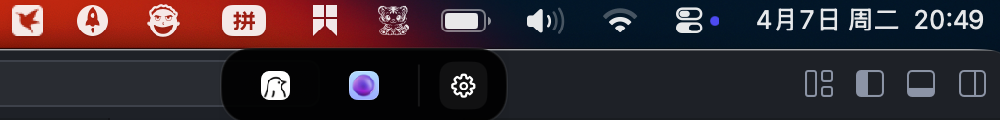
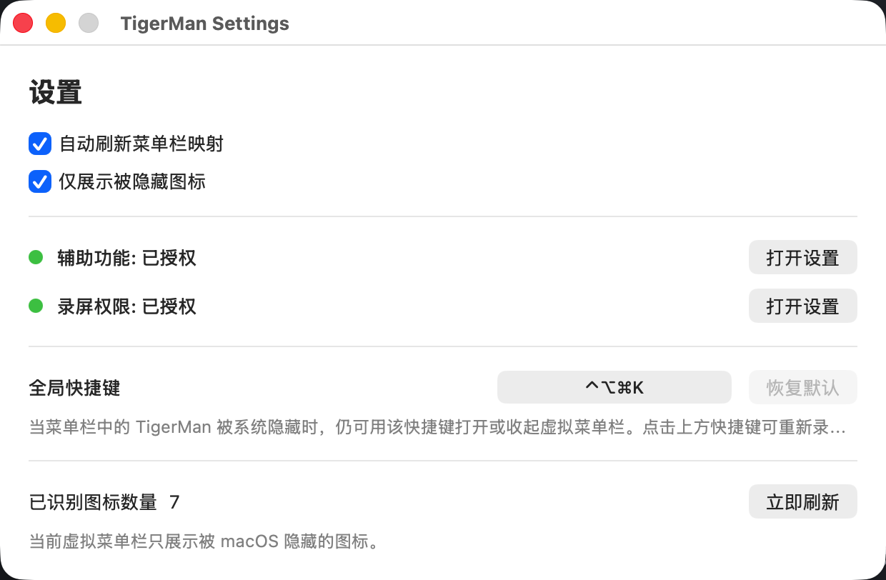

<div align="center">
<a href="https://github.com/kkwalking/tiger-man"></a>
</div>
<h1 align="center">Tiger Man</h1>

<h4 align="center">English ｜ <a href="README_zh.md">简体中文</a></h4>

<strong>TigerMan is a macOS menu bar utility built to provide an operable "virtual menu bar" entry, making app icons hidden by macOS clickable again.</strong>

## Screenshots

Virtual menu bar preview:

<div align="center"></div>

Settings preview:

<div align="center"></div>


## Background

On MacBook Air, notched displays, and smaller screens, the right side of the macOS menu bar gets crowded very quickly. As more apps stay in the menu bar, some icons become difficult to reach, and some are pushed out of the visible area entirely.

TigerMan is not trying to take over or reorder the system menu bar. Instead, it adds a separate entry point:

- Keep the original menu bar visible and usable
- Mirror menu bar icons inside a floating panel
- Forward clicks in that panel back to the original menu bar behavior when possible
- Provide a fallback way to open the panel even when TigerMan itself is hidden by the system

## Features

- Persistent menu bar entry: left click toggles the virtual menu bar, right click opens a menu with Preferences and Quit
- Virtual menu bar panel: displays recognized menu bar icons inside a floating panel
- Left-click / right-click forwarding: tries to preserve the original behavior of the real menu bar icons
- Hidden icon discovery: can detect third-party menu bar icons hidden by macOS because of limited space
- Global hot key: when TigerMan itself is hidden, the panel can still be opened with `Ctrl + Option + Command + K` by default
- Hidden-only mode: the settings window can switch to showing only hidden icons

## Usage

### Run and debug

Open the project in Xcode:

```bash
open TigerMan.xcodeproj
```

You can also build a Debug version from the command line:

```bash
HOME=/tmp/tigerman-home xcodebuild -project TigerMan.xcodeproj -scheme TigerMan -configuration Debug -derivedDataPath /tmp/tigerman-derived-data OBJROOT=/tmp/tigerman-obj SYMROOT=/tmp/tigerman-sym SHARED_PRECOMPS_DIR=/tmp/tigerman-precomp CLANG_MODULE_CACHE_PATH=/tmp/tigerman-clang-module-cache MODULE_CACHE_DIR=/tmp/tigerman-module-cache SDK_STAT_CACHE_DIR=/tmp/tigerman-sdk-stat-cache build
```

### First launch

1. Launch TigerMan.
2. Grant Accessibility and Screen Recording permissions when prompted by macOS.
3. Left-click the TigerMan icon in the menu bar to open the virtual menu bar.
4. Click mirrored icons inside the panel to trigger the original menu bar behavior.
5. If TigerMan itself is pushed out of the visible menu bar, use the global hot key `Ctrl + Option + Command + K` to open the panel.

### Settings

The settings window currently supports:

- Manual refresh of the menu bar mapping
- Recording and changing the global hot key
- Toggling hidden-only mode
- Checking current permission status

### Package a local test DMG

The repository includes a local packaging script:

```bash
./scripts/package-dmg.sh
```

The generated artifact is written to `dist/` and follows the name format `TigerMan-<version>-unsigned.dmg`. This is an unsigned test build, so on a target machine the first launch will usually require manual approval in `System Settings > Privacy & Security`.

## Project Structure

- `TigerMan/App/`: app lifecycle, refresh scheduling, panel toggling
- `TigerMan/Services/`: menu bar scanning, screenshots, permissions, hot keys, interaction forwarding
- `TigerMan/UI/`: status item entry, virtual panel, settings window
- `TigerMan/Core/`: app state, models, logging utilities
- `TigerMan/Assets.xcassets/`: icons and bundled assets
- `.codex/`: requirements, implementation notes, and development progress docs

## Notes

- The repository currently has no dedicated test target; verification mainly relies on Debug builds and manual testing
- The project does not guarantee compatibility with every third-party menu bar app
- Distribution is currently aimed at local testing, not a signed and notarized production release

## Vibe Coding Disclaimer

This project is a pure vibe coding artifact. The developer makes no guarantees about code quality.
